# kafkaesque-spark
This project showcases how to create a real-time ML inference pipeline using Spark [Structured Streaming](https://spark.apache.org/docs/latest/structured-streaming-programming-guide.html) and [KRaft Kafka](https://developer.confluent.io/learn/kraft/) running in local mode and on Kubernetes.

## Local Mode
We can create a real-time ML inference pipeline using Spark and Kafka running in a standalone mode.

### Kafka with KRaft
Download v3.3.1 of kafka which is compatible with Scala 2.13 from [Kafka Download Page](https://kafka.apache.org/downloads). Uncompress the archive in a desired location.

To configure Kafka with KRaft, navigate to directory where kafka archive was uncompressed and generate a Cluster UUID using the following command:
```
KAFKA_CLUSTER_ID="$(bin/kafka-storage.sh random-uuid)"
```
Format the log directories using the following command:
```
bin/kafka-storage.sh format -t $KAFKA_CLUSTER_ID -c config/kraft/server.properties
```
Start the Kafka server using the following command:
```
bin/kafka-server-start.sh config/kraft/server.properties
```
From another terminal/shell, create the input and output topics using the following commands:
```
bin/kafka-topics.sh --bootstrap-server localhost:9092 --create --topic kaspar-inputs
```
```
bin/kafka-topics.sh --bootstrap-server localhost:9092 --create --topic kaspar-outputs
```
`kaspar-inputs` will contain the input messages for our ML model and `kaspar-outputs` will contain the inference results of our ML model.

### Spark
Download v3.3.1 of Spark which is pre-built for Apache Hadoop 3.3 and compatible with Scala 2.13 from [Spark Download Page](https://spark.apache.org/downloads.html). Uncompress the archive in a desired location.

### Run
Follow the instructions provided under [kaspar-model](kaspar-model/README.md) to generate the application JAR. Navigate to the directory where spark archive was uncompressed and submit the spark application JAR using the following command:
```
./bin/spark-submit --class com.kaspar.model.spark.KasparStreaming \
    --master local \
    <PATH_TO>/kafkaesque-spark/kaspar-model/target/kaspar-model-1.0.0-SNAPSHOT.jar \
    localhost:9092 \
    kaspar-inputs \
    kaspar-outputs
```
Where 
* `PATH_TO` refers to the path leading up to the `kafkaesque-spark` project
* `localhost:9092` is the broker host for Kafka
* `kaspar-inputs` is the topic from which the ML model will consume the input features
* `kaspar-outputs` is the topic to which the ML model will produce inferences

Open one terminal/shell for Kakfa Producer and one for Kafka Consumer. On the Consumer terminal, change directory to `kaspar-client/files` and run the consumer client using the following command:
```
./kafka-client.py consumer -s localhost:9092 -t kaspar-outputs
```
On the Producer terminal, change directory to `kaspar-client/files` and run the producer client using the following command. The producer will iterate over the contents of `kaspar-client/files/kaspar.csv` and produce one message per row per second.
```
/kafka-client.py producer -s localhost:9092 -t kaspar-inputs
```
#### The output on producer terminal should look like this:
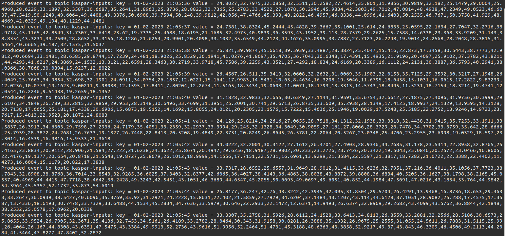

#### The output on consumer terminal should look like this:
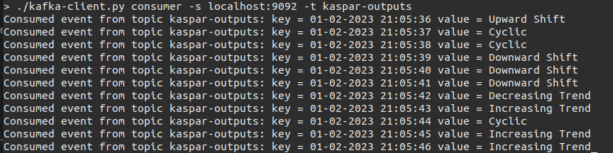

## Kubernetes
Before proceeding with the installation and setup instructions, make sure [Docker](https://docs.docker.com/install/) is available on your host machine. We will be using [k3d](https://k3d.io/), which is a light-weight wrapper to run [k3s](https://github.com/rancher/k3s) in docker and making it easy to create single-node and multi-node k3s clusters in docker.

### Docker network
To enable docker containers to communicate with each other using container names, we will use the following command to create a dedicated bridge network:
```
docker network create kaspar-net
```

### Installation
The following steps will walk you through the installation of tools required to work with Kubernetes.

### Install kubectl
```
curl -LO "https://dl.k8s.io/release/$(curl -L -s https://dl.k8s.io/release/stable.txt)/bin/linux/amd64/kubectl"
```
```
chmod +x kubectl
```
```
mkdir -p ~/.local/bin
```
```
mv ./kubectl ~/.local/bin/kubectl
```
Validated on `Client Version: {Major:"1", Minor:"23", GitVersion:"v1.23.2"}` and `Server Version: {Major:"1", Minor:"23", GitVersion:"v1.23.6+k3s1"}`

### Install k3d
Use the following command to install k3d or visit [k3d](https://k3d.io/) for other options.
```
curl -s https://raw.githubusercontent.com/k3d-io/k3d/main/install.sh | bash
```
Validated on `k3d version v5.4.3, k3s version v1.23.6-k3s1`

### Install helm
Use the following command to install helm or visit [helm](https://helm.sh/) for other options.
```
curl https://raw.githubusercontent.com/helm/helm/main/scripts/get-helm-3 | bash
```

### Setup
The following steps will walk you through the setup of Kafka and Spark on a k3d cluster.

### Create Cluster
Use the following command to create a new three-node cluster spanning three availability zones:
```
k3d cluster create kaspar-cluster \
  --network kaspar-net \
  --port "8080:30080@server:*" \
  --agents 3 \
  --k3s-node-label topology.kubernetes.io/zone=zone-a@agent:0 \
  --k3s-node-label topology.kubernetes.io/zone=zone-b@agent:1 \
  --k3s-node-label topology.kubernetes.io/zone=zone-c@agent:2 \
  --k3s-arg '--no-deploy=traefik@server:*'
```

#### This will create a cluster with the following nodes:
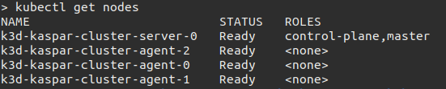

By default, k3d uses Traefik as the ingress controller for your cluster. Normally Traefik meets the needs of most Kubernetes clusters. However, in our case, we will enable Nginx Ingress Controller which offers a flexible way of routing traffic from beyond our cluster to internal Kubernetes Services. The Ingress Controller service runs on port `80` which is then mapped to the port `8080` of the host machine.

### Create Namespace
```
kubectl create namespace kaspar
```

### Install Kafka KRaft
Change directory to `kafkaesque-spark/kaspar-cluster` and deploy Kafka KRaft using the following command:
```
kubectl apply -f kafka.yaml
```
#### This StatefulSet will create three Kafka broker pods and a headless service.
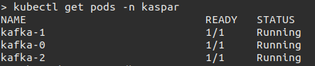

#### There are also three independent PersistentVolumeClaims created for storing Kafka data, one for each broker.
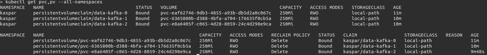

#### Describe the Kafka service
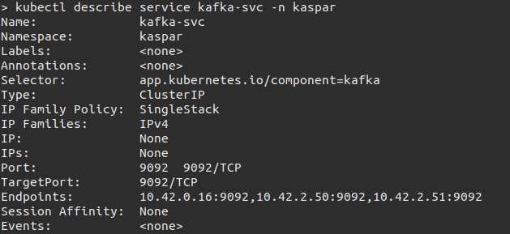

#### Get the Kafka service endpoints
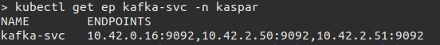

### Install Kafka Client
Build the Docker image for `kaspar-client` from the instructions provided under [kaspar-client](kaspar-client/README.md). Import the Docker image into the k3d cluster using the following command:
```
k3d images import kaspar-client:latest -c kaspar-cluster
```
### Install Spark Cluster
Build the Docker image for `kaspar-spark` from the instructions provided under [kaspar-cluster](kaspar-cluster/README.md). Import the Docker image into the k3d cluster using the following command:
```
k3d images import kaspar-spark:latest -c kaspar-cluster
```

Change directory to `kafkaesque-spark/kaspar-cluster` and deploy Spark using the following command:
```
kubectl apply -f spark.yaml
```

#### This Deployment will create three Spark pods: one for master and two for workers.
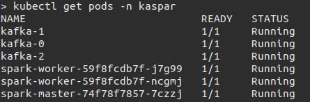

### Submit Application
Create the spark application JAR by running the following command from `kafkaesque-spark/spark-cluster`:
```
mvn clean install
```

This will create `kaspar-model-1.0.0-SNAPSHOT.jar` file under `kafkaesque-spark/spark-cluster/target` folder. Copy this file to the spark master pod by running the following command from `kafkaesque-spark/spark-cluster`:
```
kubectl cp target/kaspar-model-1.0.0-SNAPSHOT.jar kaspar/spark-master-74f78f7857-7czzj:/tmp/
```
Replace `spark-master-74f78f7857-7czzj` with the pod name of spark master pod on your system.

### Run
Get the list of Kafka endpoints by running the following command:
```
kubectl get ep kafka-svc -n kaspar | tail +2 | awk '{print $2}'
```
The output should look something like this:
```
10.42.0.16:9092,10.42.2.50:9092,10.42.2.51:9092
```

SSH into the spark master pod by running the following command:
```
kubectl exec -it spark-master-74f78f7857-7czzj -n kaspar -- /bin/bash
```
Replace `spark-master-74f78f7857-7czzj` with the pod name of spark master pod on your system.

Submit the spark application JAR using the following command:
```
./bin/spark-submit --master spark://$(hostname -i):7077 \
    --conf spark.driver.host=$(hostname -i | tr '.' '-').$(cat /var/run/secrets/kubernetes.io/serviceaccount/namespace).pod.cluster.local \
    --class com.kaspar.model.spark.KasparStreaming \
    /tmp/kaspar-model-1.0.0-SNAPSHOT.jar \
    10.42.0.16:9092,10.42.2.50:9092,10.42.2.51:9092 \
    kaspar-inputs \
    kaspar-outputs
```
Update the Kafka broker list `10.42.0.16:9092,10.42.2.50:9092,10.42.2.51:9092` with values from your system.

#### Navigate to http://localhost:8080 on your browser to access the Spark UI which will list the running application and available workers.
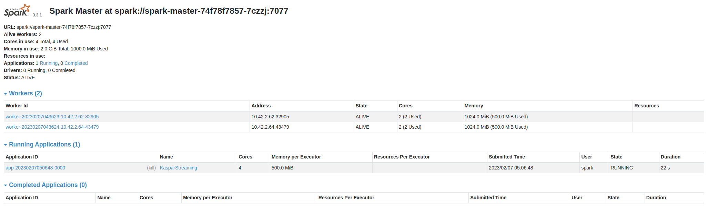

Open one terminal/shell for Kakfa Producer and one for Kafka Consumer. On the producer terminal run the following command:
```
kubectl run kaspar-producer --rm -ti --image kaspar-client:latest --image-pull-policy Never -- bash
```
On the consumer terminal run the following command:
```
kubectl run kaspar-consumer --rm -ti --image kaspar-client:latest --image-pull-policy Never -- bash
```
From the producer terminal, start the event producer by running the following command:
```
./kafka-client.py producer -s 10.42.0.16:9092,10.42.2.50:9092,10.42.2.51:9092 -t kaspar-inputs
```
From the consumer terminal, start the event consumer by running the following command:
```
./kafka-client.py consumer -s 10.42.0.16:9092,10.42.2.50:9092,10.42.2.51:9092 -t kaspar-outputs
```
#### The output on producer terminal should look like this:
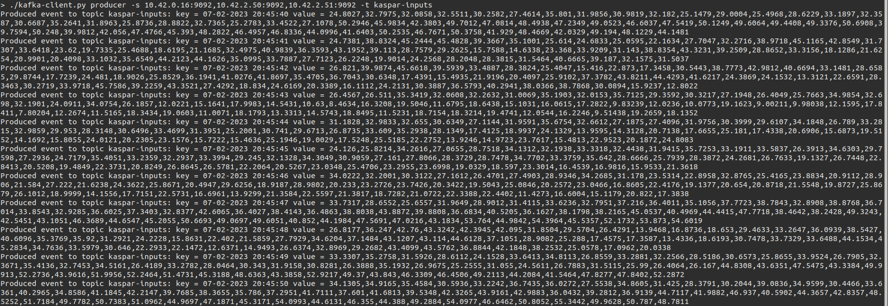

#### The output on consumer terminal should look like this:
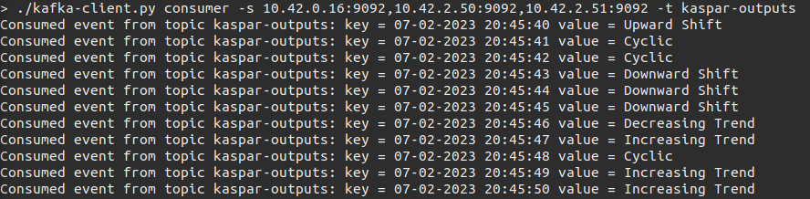